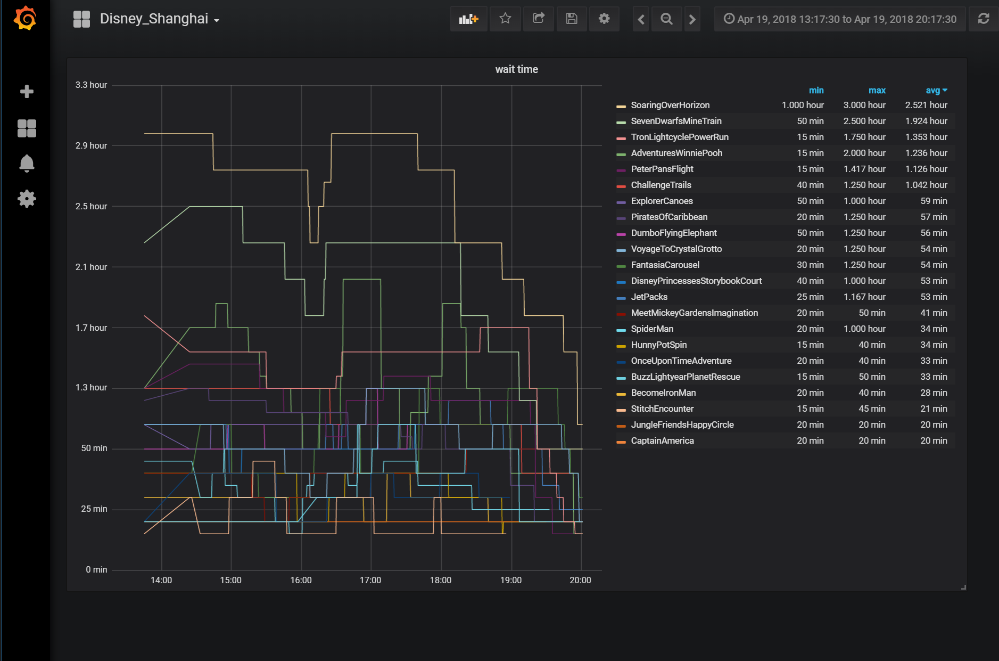

# Wait_Disney (等迪)

## What is this ?

This is a idea from [Tiantian Gao](https://github.com/gtt116)'s project [wait4disney](https://github.com/gtt116/wait4disney). However, I focus on the statistic of wait time, so I remove the **Heatmap** part in Gao's project, and modify the spider part and fix the code to python3.

Hope that it would be helpful to you.

## Installation

1. install influxdb
2. install grafana

```bash
$ https://github.com/HughWen/wait_disney
$ cd wait_disney
$ pip install -r requirements.txt
$ python main.py
```
The influxdb configration was hard coded at main.py, please feel free to change
them to meet your environment.

You can setup a crontab job to update disney waiting queue every minute.
The grafana dashboard template locates at `wait_disney/doc/grafana.json`, you can
import it to give a try.

## Web Snapshot



[demo link](https://snapshot.raintank.io/dashboard/snapshot/Faff5WVVo6QQ4EM4xuBfAcOLJdSqv0hL)